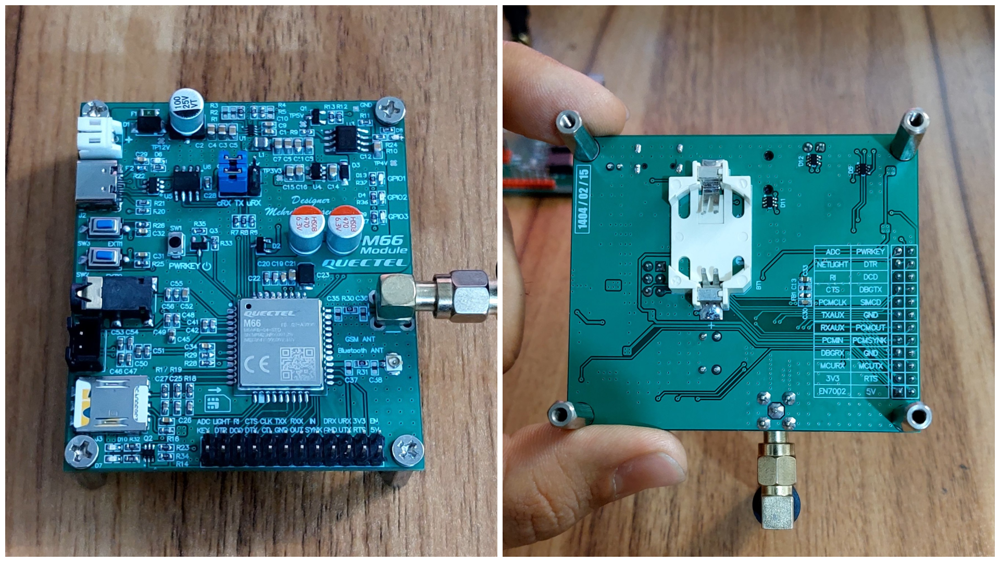

# M66 GSM Development Board

This repository contains documentation and resources for a custom development board built around the **Quectel M66 GSM module**. It offers a compact, user-friendly platform for prototyping, testing, and developing GSM-based applications, including those using the OpenCPU feature.

## 💡 Features

- ✅ **On-board USB to Serial Converter**  
  Equipped with a CH340N USB-to-Serial IC for direct connection to a PC via USB.

- 📶 **Nano SIM Card Slot**  
  Integrated nano SIM holder for network access.

- 📍 **Standard Pin Headers**  
  All essential M66 pins on standard 2.54mm headers for easy prototyping.

- 🎧 **Headset Input & Speaker Output**  
  Audio interface for GSM voice applications using external headset and speaker.

- 🕹 **Push Button & LED**  
  Useful for testing and interacting with OpenCPU-based applications.

- 🔋 **Coin Cell Battery connector for RTC**  
  Supports a coin cell battery to power the module's real-time clock (RTC) when external power is off.

## Applications

- GSM-based IoT prototyping  
- OpenCPU firmware development  
- IoT (Internet of Things) communication
- SMS / Call-based control systems
- Remote data monitoring
- GSM-based notification systems




## Pinout

| Pin Name | Description                                                |
|----------|------------------------------------------------------------|
| ADC      |Anlog to Digital converter pin                              |  
| NETLIGHT |Network status indication                                   |
| RI       |Ring indication                                             |
| CTS      |Clear to send                                               |  
| PCMCLK   |PCM clock                                                   | 
| TXAUX    |Transmit pin for Auxiliary Port                             |
| RXAUX    |Receive pin for Auxiliary Port                              |
| PCMIN    |PCM data input                                              |
| DBGRX    |Receive pin for debug port                                  |
| MCURX    |The microcontroller's RX pin should be connected to this pin|
| +3V3     |+3.3 V output                                               |
| EN7002   |GSM module Buck converter IC(TPS7A7002) enable pin          |
| PWRKEY   |On/Off Module                                               |
| DTR      |Data terminal ready                                         |  
| DCD      |Data carrier detection                                      |
| DBGTX    |Transmit pin for debug port                                 |
| SIMCD    |Sim Card Detection pin                                      |  
| GND      |Ground                                                      | 
| PCMOUT   |PCM data outout                                             |
| PCMSYNK  |PCM frame synchronization                                   |
| GND      |Ground                                                      |
| MCUTX    |The microcontroller's TX pin should be connected to this pin|
| RTS      |Request to send                                             |
| +5V      |+5V output                                                  |


## Getting Started

1. Insert a micro SIM card into the SIM card holder.
2. Selecting serial communication pins using jumpers. 
3. Install the **CH340** driver if it's not already installed.
4. Press the **PWRKEY** button for 1 second to turn on the SIM800C module.
5. There are two ways to communicate with the module :
- Using a on board **USB to serial** converter for direct communicate with M66 module and Use any serial terminal (like PuTTY or hterm) to communicate with the module via AT commands.
- Using a pin header for communication **MCU** with M66 module.

## Notes


- To use the converter, the jumpers must be connected in such a way that TX is connected to cRX and RX is connected to cTX.
- To communicate with the MCU, jumpers must be set so that TX is connected to uRX and RX is connected to uTX.
```
TX  -> Module Transmit pin
RX  -> Module Receive pin
uRX -> Microcontroller Receive pin
uTX -> Microcontroller Transmit pin
cRX -> CH340n Receive pin
cTX -> CH340n Transmit pin
```
- The MCURX and MCUTX pins must be connected exactly to the RX and TX pins of the microcontroller and not MCURX to TX and MCUTX to RX.
```
❌
MCUTX pin --- Microcontroller RX pin
MCURX pin --- Microcontroller TX pin

✅
MCUTX pin --- Microcontroller TX pin
MCURX pin --- Microcontroller RX pin
```

## License

This project is open-source and released under the [MIT License](LICENSE).

## Author

Designed by [Mehrdad Qasemi Taj](https://github.com/Mehrdad-QasemiTaj)

---
